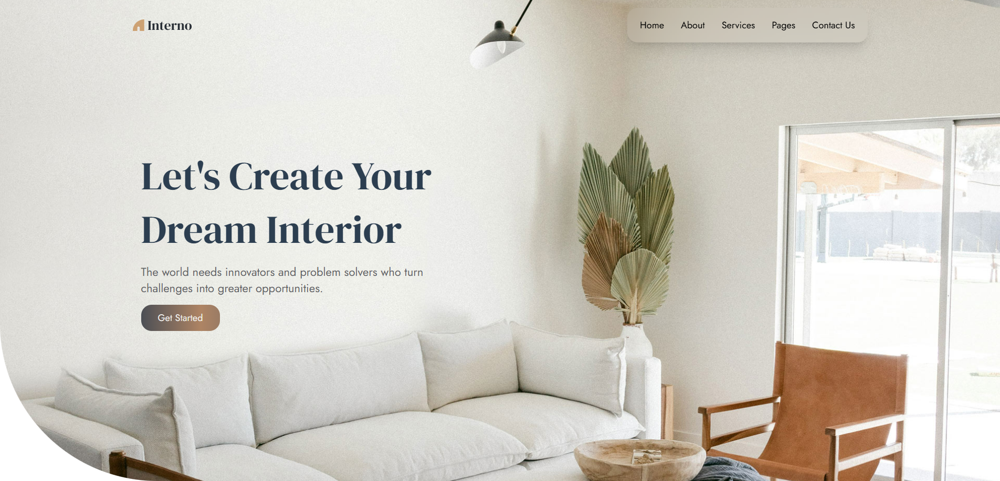

**🌍 Live
Demo: [interior-app-sigma.vercel.app](https://interior-app-sigma.vercel.app/)**

# Interior – a site for people who are looking for a new idea in design

---

## ⚙️ Technologies and stack

---

- **React**
- **TypeScript**
- **TailwindCSS**
- **Formik**
- **Yup**
- **Firebase**
- **Framer Motion**
- **Swiper**
- **React Toastify**
- **React Router DOM**

## ✨ Features

---

- Browse and explore interior design ideas
- Booking form with validation
- Fully responsive design
- Smooth animations
- Firebase authentication
- Toast notifications

## 🚀 Local project launch

---

**Clone the repository**

`https://github.com/viiktory/interior-app.git`

**Install dependencies**

`npm install`

**Run the project**

`npm start`

Now, head to **http://localhost:5173** in your browser
